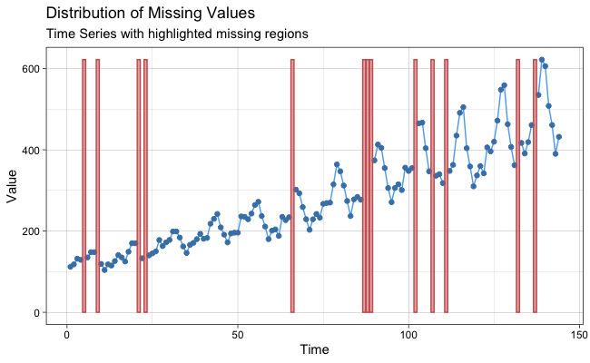

[](http://www.repostatus.org/#active)
[](https://travis-ci.org/SteffenMoritz/imputeTS)
[](https://ci.appveyor.com/project/steffenmoritz/imputeTS)
[](https://codecov.io/gh/SteffenMoritz/imputeTS)
[](https://cran.r-project.org/package=imputeTS)
[](https://cran.r-project.org/package=imputeTS)
[](https://cran.r-project.org/package=imputeTS)


# imputeTS: Time Series Missing Value Imputation 

The imputeTS package specializes on (univariate) time series imputation. 
It offers several different imputation algorithm implementations. Beyond the imputation algorithms the package also provides plotting and printing functions of time series missing data statistics. Additionally three time series datasets for imputation experiments are included.

### Installation

The imputeTS package can be found on [CRAN]. For installation execute in R:

```
 install.packages("imputeTS")
```

If you want to install the latest version from GitHub (can be unstable) run:

```
library(devtools)
install_github("SteffenMoritz/imputeTS")
```

### Usage
- ###### Imputation

  To impute (fill all missing values) in a time series ***x***, run the following
  command:
  ```
   na_interpolation(x)
  ```
  Output is the time series ***x*** with all NA's replaced by reasonable values.

  > This is just one example for an imputation algorithm. 
  > In this case interpolation was the algorithm of choice for 
  > calculating the NA replacements. There are several other 
  > algorithms (see also under caption "Imputation Algorithms"). All 
  > imputation functions   are named alike starting with
  > na_ followed by a algorithm label  e.g. na_mean, na_kalman, ...


- ###### Plotting

  To plot missing data statistics for a time series ***x***, run the following
  command:
  ```
   ggplot_na_distribution(x)
  ```
  <p align="center">
  
 </p>
  
  
  > This is also just one example for a plot. Overall there are four different types 
  > of missing data plots. (see also under caption "Missing Data Plots"). 

- ###### Printing

  To print statistics about the missing data in a time series ***x***, run the
  following command:
  ```
   statsNA(x)
  ```
  
- ###### Datasets

  To load the *'heating'* time series (with missing values)  into  a variable ***y*** and the *'heating'* time series (without missing values) into a variable ***z***, run: 
  ```
   y <- tsHeating
   z <- tsHeatingComplete
  ```
  > There are three datasets provided with the package, the *'tsHeating'*, the 
  > *'tsAirgap'* and the *'tsNH4'* time series. (see also under caption "Datasets"). 

### Imputation Algorithms

Here is a table with available algorithms to choose from:

|      Function        |           Description                                      | 
| :--------------------|:-----------------------------------------------------------|
| na_interpolation     |Missing Value Imputation by Interpolation                   |
| na_kalman            |Missing Value Imputation by Kalman Smoothing                |
| na_locf              |Missing Value Imputation by Last Observation Carried Forward|
| na_ma                |Missing Value Imputation by Weighted Moving Average         |
| na_mean              |Missing Value Imputation by Mean Value                      | 
| na_random            |Missing Value Imputation by Random Sample                   | 
| na_remove            |Remove Missing Values                                       | 
| na_replace           |Replace Missing Values by a Defined Value                   | 
| na_seadec            |Seasonally Decomposed Missing Value Imputation              | 
| na_seasplit          |Seasonally Splitted Missing Value Imputation                | 

  > This is a rather broad overview. The functions itself mostly offer more
  > than just one algorithm. For example na_interpolation can be set to linear
  > or spline interpolation.

More detailed information about the algorithms and their options can be found in the [imputeTS reference manual].

### Missing Data Plots

Here is a table with available plots to choose from:

|      Function           |           Description                                        | 
| :-----------------------|:-------------------------------------------------------------|
| ggplot_na_distribution  |Visualize Distribution of Missing Values                      |
| ggplot_na_intervals     |Missing Values Summarized in Intervals                        |
| ggplot_na_gapsize       |Visualize Distribution of NA Gapsizes                         |
| ggplot_na_imputations   |Visualize Imputed Values                                      | 

More detailed information about the plots can be found in the [imputeTS reference manual].

### Datasets

There are three datasets (each in two versions) available:

|      Dataset     |             Description                                          | 
| :----------------|:-----------------------------------------------------------------|
| tsAirgap         |Time series of monthly airline passengers (with NAs)              |
| tsAirgapComplete |Time series of monthly airline passengers (complete)   |
| tsHeating        |Time series of a heating systems supply temperature (with NAs)    |
| tsHeatingComplete|Time series of a heating systems supply temperature (complete)    |
| tsNH4            |Time series of NH4 concentration in a wastewater system (with NAs)|
| tsNH4Complete    |Time series of NH4 concentration in a wastewater system (complete)| 

  > The tsAirgap, tsHeating and tsNH4 time series are with NAs. Their **complete** versions are
  > without NAs. Except the missing values their versions are identical.
  > The NAs for the time series were artifically inserted by simulating the missing
  > data pattern observed in similar non-complete time series from the same domain.
  > Having a complete and incomplete version of the same dataset is useful for
  > conducting experiments of imputation functions.
 
  More detailed information about the datasets can be found in the [imputeTS reference manual].

### Reference
You can cite imputeTS the following: 

  > Moritz, Steffen, and Bartz-Beielstein, Thomas. "imputeTS: Time Series Missing Value Imputation in R." R Journal 9.1 (2017). doi: 10.32614/RJ-2017-009.
 

### Need Help?
If you have general programming problems or need help using the package please ask your question on [StackOverflow]. By doing so all users will be able to benefit in the future from your question.

> Don't forget to mark your question with the [imputets] tag on StackOverflow to get me notified

### Support
If you found a bug or have suggestions, feel free to get in contact via steffen.moritz10 at gmail.com.

> All feedback is welcome


### Version
**3.1**

### License
GPL-3


   [CRAN]: <https://cran.r-project.org/package=imputeTS>  
   [imputeTS reference manual]: <https://cran.r-project.org/package=imputeTS>
   [Citation]: <https://cran.r-project.org/web/packages/imputeTS/citation.html>
   [StackOverflow]: <https://stackoverflow.com/tags/imputets/info> 
   [imputets]: <https://stackoverflow.com/questions/tagged/imputets>
 